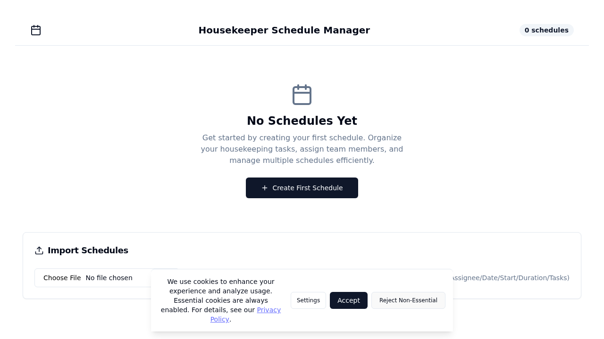
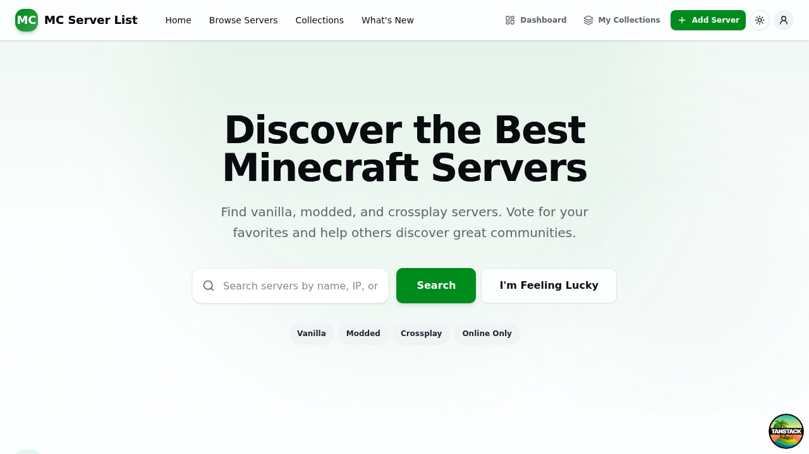
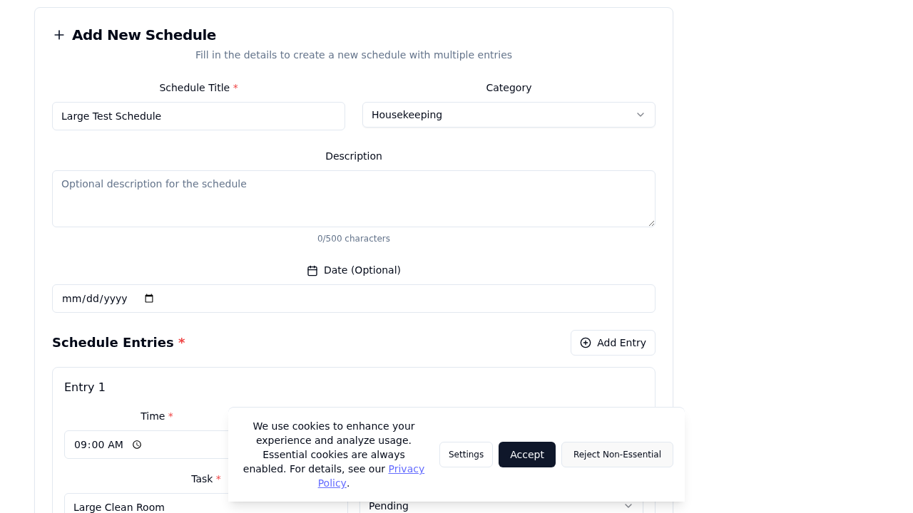

# Housekeeper Schedule Manager

A modern web application for managing housekeeper schedules with CSV import/export capabilities, built with React, TypeScript, Tailwind CSS, and shadcn/ui components.

## Features

- **Add, edit, and delete** housekeeper schedules with form validation
- **Optional date assignment** for schedules with formatted display
- **Time range specification** (start/end times) with duration calculation
- **Task descriptions** with character limits and bullet-point formatting
- **CSV import/export** functionality with proper error handling
- **Professional print view** optimized for letter-size paper
- **Responsive design** with shadcn/ui components and mobile-first approach
- **Local storage persistence** with automatic saving
- **Network accessible** for Cloudflare tunnel deployment
- **Loading states and visual feedback** throughout the application
- **Icons and visual hierarchy** for better user experience

## Screenshots





These screenshots demonstrate the application's load states and responsive behavior before and after mobile optimizations.

## Technology Stack

- **Frontend**: React 18 + TypeScript + Vite 4
- **UI Components**: shadcn/ui + Tailwind CSS 3.3
- **Icons**: Lucide React
- **Backend**: Express.js (API for CSV export)
- **Build Tool**: Vite with esbuild
- **Styling**: Tailwind CSS with PostCSS
- **Deployment**: Cloudflare Tunnel ready
- **Validation**: Custom React form validation

## Quick Start

### Prerequisites

- Node.js 18+
- npm or yarn
- Cloudflare CLI (`cloudflared`) for tunnel deployment (optional)

### Installation

```bash
# Clone the repository
git clone <your-repo-url>
cd HK-Schedules

# Install dependencies
npm install
```

### Development Setup

The project uses a dual-server architecture for optimal development experience:

**Terminal 1 - Vite Development Server (UI + Hot Reload)**
```bash
# Start React development server on port 3001
HOST=0.0.0.0 npm run dev
```
- Serves the React app with hot module replacement
- Proxies `/export-csv` API calls to Express server
- Accessible at: http://localhost:3001
- Network accessible for Cloudflare tunnel

**Terminal 2 - Express API Server (CSV Export API)**
```bash
# Start API server on port 4000
npm start
```
- Handles CSV export POST requests at `/export-csv`
- Redirects UI requests to Vite dev server in development
- Serves production build from `dist/` folder

**Terminal 3 - Cloudflare Tunnel (External Access)**
```bash
# Quick tunnel for development
cloudflared tunnel --url http://localhost:3001

# Or named tunnel for production
cloudflared tunnel run housekeeper-app
```

### Production Build & Deploy

```bash
# Build the React application for production
npm run build

# Preview the production build locally
npm run preview

# Start production server (single server serving everything)
npm start

# For Cloudflare tunnel in production
cloudflared tunnel --url http://localhost:4000
```

## Project Structure

```
HK-Schedules/
├── index.html                    # Vite entry point
├── src/                          # React source code
│   ├── main.tsx                  # React root rendering
│   ├── App.tsx                   # Main application component
│   ├── index.css                 # Global styles + Tailwind directives
│   ├── components/               # Feature components
│   │   ├── schedule-form.tsx     # Schedule CRUD form with validation
│   │   ├── schedule-table.tsx    # Enhanced schedule display table
│   │   └── print-schedule.tsx    # Professional print view component
│   └── components/ui/            # shadcn/ui components
│       ├── button.tsx            # Button component
│       ├── input.tsx             # Input component
│       ├── label.tsx             # Form label component
│       ├── textarea.tsx          # Textarea component
│       ├── card.tsx              # Card container component
│       ├── table.tsx             # Table components (Table, Td, Th, etc.)
│       ├── badge.tsx             # Badge component
│       └── alert.tsx             # Alert/notification component
├── server.js                     # Express API server (dev/prod)
├── vite.config.ts                # Vite build configuration
├── tailwind.config.js            # Tailwind CSS configuration
├── postcss.config.js             # PostCSS configuration
├── tsconfig.json                 # TypeScript configuration
├── components.json               # shadcn/ui configuration
├── package.json                  # Dependencies and npm scripts
├── README.md                     # Project documentation
└── .gitignore                    # Git ignore rules
```

## UI Components & Features

### **Enhanced Form Experience**
- **Real-time validation** with error messages and visual feedback
- **Required field indicators** with clear labeling
- **Character counting** for task descriptions (max 500 chars)
- **Loading states** during form submission
- **Icons for each field** (User, Calendar, Clock, List)
- **Responsive grid layout** for time inputs
- **Auto-clear errors** when user starts typing

### **Professional Schedule Table**
- **Duration calculation** (e.g., "2h 30m") with badges
- **Formatted dates** with weekday names
- **Avatar-style housekeeper display** with circular photos
- **Icon action buttons** (Edit, Delete) with loading states
- **Hover effects** and alternating row colors
- **Mobile-optimized empty state** with call-to-action
- **Truncated task descriptions** with line clamping
- **Compact time display** with start/end times

### **Print-Optimized View**
- **Professional letterhead** with company name and print timestamp
- **Clean table layout** without UI distractions
- **Black borders and proper spacing** for printed documents
- **Task bullet points** for easy reading
- **Total duration summary** and schedule count
- **Page break optimization** to avoid awkward breaks
- **Color consistency** with `color-adjust: exact`

### **Visual Design System**
- **Consistent spacing** using Tailwind's spacing scale
- **Professional color palette** from shadcn/ui
- **Icon integration** throughout with Lucide React
- **Loading animations** and visual feedback
- **Responsive breakpoints** for all screen sizes
- **Accessible color contrast** and focus states

## Configuration Files

### Vite Configuration (`vite.config.ts`)

```ts
export default defineConfig({
  plugins: [react()],
  resolve: {
    alias: { "@": path.resolve(__dirname, "./src") }
  },
  server: {
    port: 3001,                    // Development server port
    host: true,                    // Allow external connections
    proxy: {                       // API proxy configuration
      '/export-csv': {
        target: 'http://localhost:4000',
        changeOrigin: true,
      }
    }
  },
  build: {
    outDir: 'dist',
    assetsDir: 'assets'
  }
})
```

### Server Configuration (`server.js`)

```js
// Dual-mode architecture for development/production
if (process.env.NODE_ENV !== 'production') {
  // Development: Vite UI (3001) + Express API (4000)
  app.get('*', (req, res) => {
    res.redirect(`http://localhost:3001${req.originalUrl}`)
  })
} else {
  // Production: Single server serving dist/ folder
  app.use(express.static('dist'))
  app.get('*', (req, res) => {
    res.sendFile(path.join(__dirname, 'dist', 'index.html'))
  })
}
```

### Tailwind Configuration (`tailwind.config.js`)

```js
export default {
  darkMode: ["class"],
  content: ['./src/**/*.{ts,tsx}', './index.html'],
  theme: {
    container: {
      center: true,
      padding: "2rem",
      screens: { "2xl": "1400px" }
    },
    extend: {
      // shadcn/ui CSS variables for consistent theming
      colors: {
        border: "hsl(var(--border))",
        input: "hsl(var(--input))",
        // ... other theme colors
      }
    }
  },
  plugins: [require("tailwindcss-animate")]
}
```

## Cloudflare Tunnel Setup

### Development Tunnel (Port 3001)

```bash
# Terminal 1: Vite dev server
HOST=0.0.0.0 npm run dev

# Terminal 2: Express API server
npm start

# Terminal 3: Quick tunnel
cloudflared tunnel --url http://localhost:3001
```

### Production Tunnel (Port 4000)

```bash
# Build and start production
npm run build
npm start

# Tunnel to production server
cloudflared tunnel --url http://localhost:4000
```

### Named Tunnel Configuration

Create `~/.cloudflared/config.yml`:
```yaml
tunnel: housekeeper-app
credentials-file: ~/.cloudflared/[tunnel-uuid].json

ingress:
  - hostname: appahouse.com
    service: http://localhost:3001  # Development
  # - hostname: appahouse.com
  #   service: http://localhost:4000  # Production
  - service: http_status:404
```

Route DNS:
```bash
cloudflared tunnel route dns housekeeper-app appahouse.com
```

Run tunnel:
```bash
cloudflared tunnel run housekeeper-app
```

## Usage Guide

### Adding Schedules

1. **Click "Add New Schedule"** - Opens validation-enabled form
2. **Housekeeper Name** - Required, minimum 2 characters
3. **Date** - Optional, formats to "Mon, Sep 15, 2025"
4. **Time Slot** - Required start/end times with validation (end > start)
5. **Tasks** - Up to 500 characters, auto-formatted as bullet points
6. **Validation** - Real-time error messages with visual feedback

### Schedule Management

- **Edit** - Click edit icon (pencil) next to any schedule
- **Delete** - Click delete icon (trash) with confirmation and loading state
- **Duration Display** - Automatic calculation (e.g., "2h 30m")
- **Last Updated** - Shows when schedule list was last modified

### Import/Export

**CSV Import Format:**
```
Name,Date,Start,End,Tasks
John Doe,2025-09-15,09:00,12:00,"Clean kitchen, vacuum living room, dust surfaces"
```

**Features:**
- Automatic header detection and skipping
- Error handling for malformed CSV
- Visual confirmation of imported count
- Preserves existing schedules

**CSV Export:**
- Downloads formatted CSV with proper escaping and quote handling
- Includes all schedule data (Housekeeper, Assignee, Date, Start Time, Duration, Tasks)
- Fully compatible with Chrome (fixed compatibility issues with Blob-based downloads and CSV escaping)
- Cross-browser support (Chrome, Firefox, Safari, Edge)
- Handles special characters, commas, and quotes in task descriptions
- UTF-8 BOM included for Excel compatibility

### Print View

**Professional Print Features:**
- Company letterhead with customizable name
- Print timestamp and preparation info
- Clean table without UI distractions
- Task bullet points for readability
- Total duration and schedule count
- Optimized for letter-size paper (8.5x11")
- Black borders and consistent spacing
- Page break avoidance for tables

**Print Process:**
1. Click "Print Schedule" button
2. Loading state while preparing print view
3. Professional preview in print dialog
4. Optimized layout for physical printing

## npm Scripts

| Script | Description | Port | Purpose |
|--------|-------------|------|---------|
| `npm run dev` | Vite dev server with HMR | 3001 | Development UI |
| `npm run build` | Production build | - | Create dist/ folder |
| `npm run preview` | Preview production build | 4173 | Test production build |
| `npm start` | Express server | 4000 | API + production serving |
| `npm run dev:full` | Full development setup | 3001+4000 | UI + API servers |

**Development Package.json Scripts (add these):**
```json
{
  "scripts": {
    "dev": "HOST=0.0.0.0 vite",
    "dev:full": "concurrently \"HOST=0.0.0.0 npm run dev\" \"npm start\"",
    "build": "tsc && vite build",
    "preview": "vite preview",
    "start": "node server.js"
  }
}
```

## Troubleshooting

### Build Issues

**"Could not resolve entry module 'index.html'"**
```
# Ensure index.html is in project root (not src/)
rm src/index.html
# Vite expects: root/index.html -> root/src/main.tsx
```

**TypeScript errors during build:**
```bash
# Check for unused imports
npm run build

# Fix common issues:
# - Remove unused variables (fileInputRef, React imports)
# - Ensure all shadcn/ui components have dependencies
# - Check for missing type exports
```

**Missing shadcn/ui dependencies:**
```bash
npm install @radix-ui/react-label @radix-ui/react-slot class-variance-authority clsx lucide-react tailwind-merge
```

### Development Server Issues

**Vite not accessible on network:**
```bash
# Ensure host binding
HOST=0.0.0.0 npm run dev

# Check what's listening
netstat -tlnp | grep 3001
```

**Port 3001 in use:**
```bash
# Kill process on port 3001
npx kill-port 3001

# Or change port in vite.config.ts
server: { port: 3002 }
```

### Cloudflare Tunnel Issues

**404 errors from tunnel:**
1. Verify Vite is running: `curl http://localhost:3001`
2. Check tunnel logs for connection status
3. Ensure `HOST=0.0.0.0` for Vite server
4. Verify DNS points to Cloudflare

**Tunnel connection refused:**
```bash
# Check firewall
sudo ufw allow 3001
sudo ufw status

# Verify Vite network binding
HOST=0.0.0.0 npm run dev
# Should show: Network: http://0.0.0.0:3001/
```

### Print View Issues

**Colors not printing correctly:**
- Browser setting: Enable "Print background colors and images"
- CSS `color-adjust: exact` is already configured

**Poor print layout:**
- Test with `Ctrl+P` and check "More settings" → "Background graphics"
- Verify `@page` margins in print CSS

## License

MIT License - see LICENSE file for details.

## Contributing

1. Fork the repository
2. Create feature branch (`git checkout -b feature/amazing-feature`)
3. Commit changes (`git commit -m 'Add amazing feature'`)
4. Push to branch (`git push origin feature/amazing-feature`)
5. Open Pull Request

## Support

For setup issues, deployment problems, or feature requests (CSV export now fully functional in Chrome):

Recent Fixes:
- **CSV Export Chrome Compatibility**: Resolved download issues with robust Blob-based implementation and proper CSV escaping
- **Data Format Handling**: Fixed export with legacy and multi-entry schedule formats
- **Defensive Programming**: Added array validation to prevent runtime errors

1. Check the [Troubleshooting](#troubleshooting) section
2. Review the [Cloudflare Tunnel Setup](#cloudflare-tunnel-setup)
3. Open an issue on GitHub with:
   - Node.js version (`node --version`)
   - npm version (`npm --version`)
   - Error messages and steps to reproduce
   - Operating system and browser details

---

**Built with React, TypeScript, shadcn/ui, and Tailwind CSS**

Professional housekeeper scheduling made simple and beautiful.